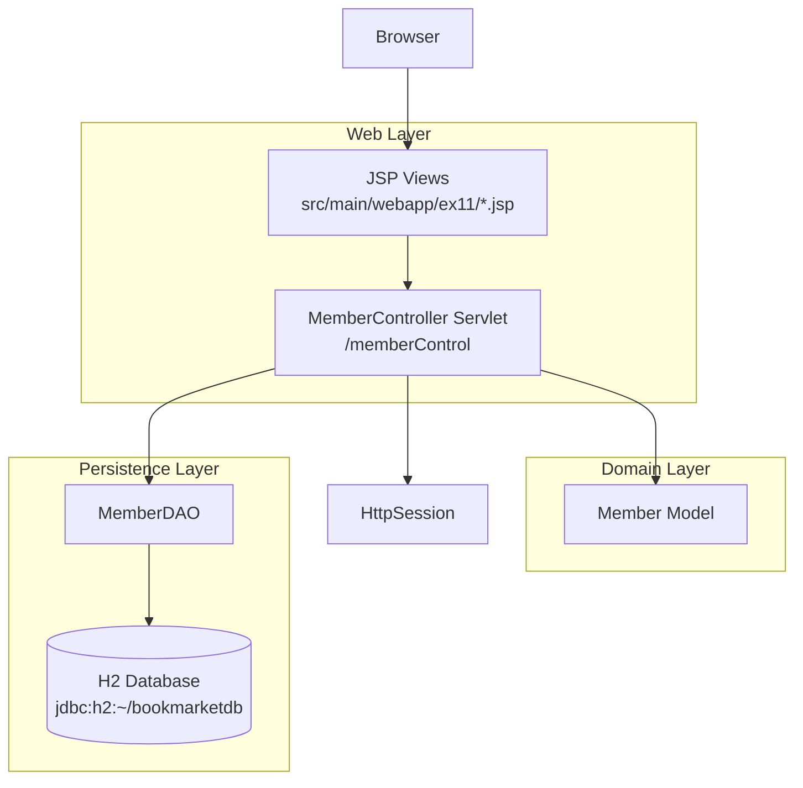
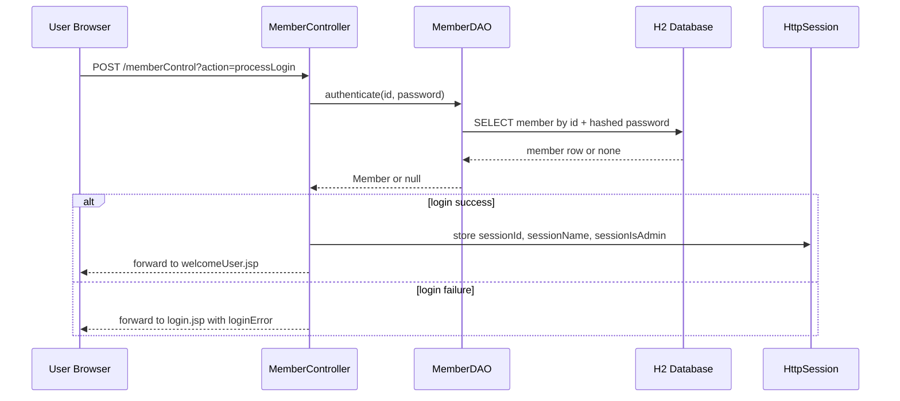
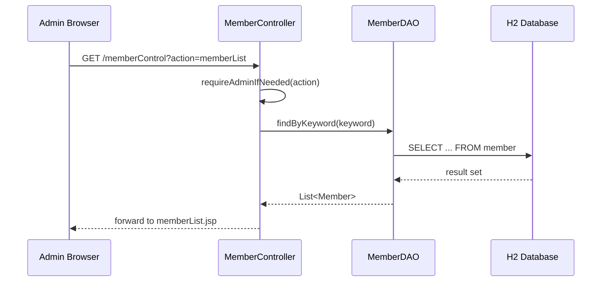

# ex11 Member System Architecture

## Overview

The `ex11` member system is a classic Servlet MVC web application packaged as a single WAR.
It runs inside a Java Servlet container and uses JSP for server-side rendering, a single servlet controller for request orchestration, JDBC for data access, and H2 as the backing database.

This is a modular monolith rather than a distributed system.

## Runtime Architecture



## Main Components

### 1. Presentation Layer

JSP pages render the UI and receive request attributes populated by the controller.

- `login.jsp`: login form and error/success feedback
- `signup.jsp`: public signup flow
- `memberList.jsp`: admin member list and search
- `memberDetail.jsp`: member detail page
- `memberForm.jsp`: create and edit member form
- `welcome.jsp`, `welcomeUser.jsp`, `menu.jsp`: landing and navigation views

Relevant paths:

- `src/main/webapp/ex11/login.jsp`
- `src/main/webapp/ex11/signup.jsp`
- `src/main/webapp/ex11/memberList.jsp`
- `src/main/webapp/ex11/memberDetail.jsp`
- `src/main/webapp/ex11/memberForm.jsp`

### 2. Controller Layer

`MemberController` is the central request dispatcher.

Responsibilities:

- reads the `action` request parameter
- performs authentication and admin authorization checks
- invokes DAO methods
- prepares request and session attributes
- forwards to the next JSP view

Relevant path:

- `src/main/java/ex11/MemberController.java`

### 3. Domain Model

`Member` is a plain Java object representing the member entity.

Fields:

- `memberId`
- `password`
- `name`
- `phone`
- `stampCount`
- `joinDate`
- `adminYn`
- `imageUrl`

Relevant path:

- `src/main/java/ex11/Member.java`

### 4. Persistence Layer

`MemberDAO` manages all database access through raw JDBC.

Responsibilities:

- open and close database connections
- member CRUD
- login authentication
- keyword-based search
- stamp increment
- password hashing before persistence
- schema compatibility check for `image_url`

Relevant path:

- `src/main/java/ex11/MemberDAO.java`

## Request Flow

### Login Flow



### Member Management Flow



## Deployment Shape

- Build tool: Maven
- Packaging: WAR
- Java level: 21
- Servlet API: 4.0.1
- View tech: JSP + JSTL
- Database: H2

Relevant paths:

- `pom.xml`
- `src/main/webapp/WEB-INF/web.xml`

## Architectural Characteristics

### Strengths

- simple and easy to understand for learning and small-scale development
- clear separation between JSP, servlet, model, and DAO
- server-side rendering keeps frontend complexity low
- session-based auth is straightforward for a classroom project

### Current Limitations

- `MemberController` contains both routing and business logic
- there is no dedicated service layer
- DAO owns connection handling directly and mixes persistence with some schema management
- auth and authorization are handled manually instead of through a security framework
- error handling and validation are controller-centric
- the architecture is tightly coupled to server-side JSP rendering

## Suggested Next-Step Architecture

If the project grows, the next reasonable structure is:

```text
Browser
  -> Servlet Controller
  -> Service Layer
  -> DAO/Repository Layer
  -> Database
```

Recommended refactor steps:

1. Extract business logic from `MemberController` into `MemberService`
2. Keep `MemberDAO` focused only on persistence
3. Centralize validation and error mapping
4. Move auth and admin checks into reusable filters or intercepting logic
5. Externalize repeated UI styles into shared CSS assets

## Key Files

- `src/main/java/ex11/MemberController.java`
- `src/main/java/ex11/MemberDAO.java`
- `src/main/java/ex11/Member.java`
- `src/main/webapp/ex11/login.jsp`
- `src/main/webapp/ex11/memberList.jsp`
- `src/main/webapp/ex11/memberDetail.jsp`
- `src/main/webapp/WEB-INF/web.xml`
- `pom.xml`